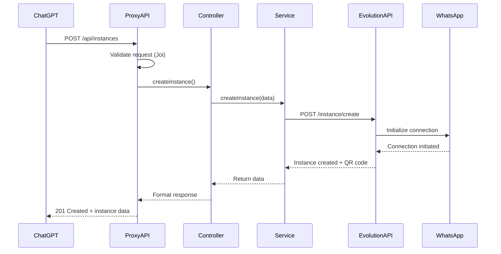
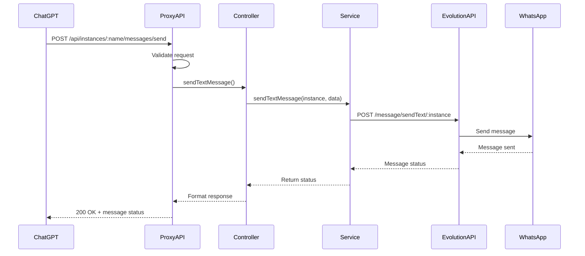

# Evolution API Proxy - Architecture Documentation

## System Architecture

```
┌─────────────────────────────────────────────────────────────────────────┐
│                           ChatGPT Actions                               │
│                     (OpenAI Custom GPT Interface)                       │
└────────────────────────────────┬────────────────────────────────────────┘
                                 │ HTTPS/JSON
                                 │ API Key Auth
                                 ▼
┌─────────────────────────────────────────────────────────────────────────┐
│                      Evolution API Proxy Backend                        │
│                         (This Application)                              │
│  ┌───────────────────────────────────────────────────────────────────┐ │
│  │                      Express.js Application                       │ │
│  │  ┌─────────────┐  ┌──────────────┐  ┌─────────────────────────┐ │ │
│  │  │   Routes    │→│ Controllers  │→│      Services           │ │ │
│  │  │             │  │              │  │  ┌─────────────────┐   │ │ │
│  │  │ - Instance  │  │ - Instance   │  │  │ Evolution API   │   │ │ │
│  │  │ - Message   │  │ - Message    │  │  │    Service      │   │ │ │
│  │  │ - Contact   │  │ - Contact    │  │  │   (Axios HTTP)  │   │ │ │
│  │  │ - Group     │  │ - Group      │  │  └─────────────────┘   │ │ │
│  │  │ - Webhook   │  │ - Webhook    │  │                         │ │ │
│  │  │ - Chat      │  │ - Chat       │  │                         │ │ │
│  │  └─────────────┘  └──────────────┘  └─────────────────────────┘ │ │
│  │         ▲                ▲                       │               │ │
│  │         │                │                       ▼               │ │
│  │  ┌──────┴────────────────┴───────────┐  ┌──────────────────┐   │ │
│  │  │        Middleware Stack           │  │  Configuration   │   │ │
│  │  │                                   │  │   - .env vars    │   │ │
│  │  │ - CORS (Cross-Origin)            │  │   - API keys     │   │ │
│  │  │ - Helmet (Security Headers)      │  │   - Endpoints    │   │ │
│  │  │ - Morgan (HTTP Logging)          │  │   - Rate limits  │   │ │
│  │  │ - Compression (Gzip)             │  └──────────────────┘   │ │
│  │  │ - Rate Limiting                  │                         │ │
│  │  │ - Request Validation (Joi)       │  ┌──────────────────┐   │ │
│  │  │ - Error Handler                  │  │  Winston Logger  │   │ │
│  │  │ - Body Parser                    │  │   - File logs    │   │ │
│  │  └───────────────────────────────────┘  │   - Console      │   │ │
│  │                                          └──────────────────┘   │ │
│  └───────────────────────────────────────────────────────────────────┘ │
└────────────────────────────────┬────────────────────────────────────────┘
                                 │ HTTPS/JSON
                                 │ API Key Auth
                                 ▼
┌─────────────────────────────────────────────────────────────────────────┐
│                          Evolution API                                  │
│                   (WhatsApp Integration Service)                        │
│                                                                         │
│  ┌──────────────┐  ┌──────────────┐  ┌──────────────┐                │
│  │  Instance    │  │   Message    │  │   Webhook    │                │
│  │  Management  │  │   Handling   │  │   Events     │                │
│  └──────────────┘  └──────────────┘  └──────────────┘                │
└────────────────────────────────┬────────────────────────────────────────┘
                                 │ WhatsApp Protocol
                                 ▼
┌─────────────────────────────────────────────────────────────────────────┐
│                         WhatsApp Servers                                │
│                      (Meta/Facebook Infrastructure)                     │
└─────────────────────────────────────────────────────────────────────────┘
```

## Layer Architecture

### 1. Presentation Layer (Routes)

**Location**: `src/routes/`

**Responsibilities**:
- Define API endpoints
- Mount route handlers
- Apply route-specific middleware
- Validate request parameters

**Key Files**:
- `index.ts` - Main router that aggregates all routes
- `instance.routes.ts` - Instance management endpoints
- `message.routes.ts` - Message operations endpoints
- `contact.routes.ts` - Contact management endpoints
- `group.routes.ts` - Group management endpoints
- `webhook.routes.ts` - Webhook configuration endpoints
- `chat.routes.ts` - Chat operations endpoints

### 2. Controller Layer

**Location**: `src/controllers/`

**Responsibilities**:
- Handle HTTP requests
- Call appropriate services
- Format responses
- Handle controller-level errors

**Key Files**:
- `instance.controller.ts` - Instance operations
- `message.controller.ts` - Message operations
- `contact.controller.ts` - Contact operations
- `group.controller.ts` - Group operations
- `webhook.controller.ts` - Webhook operations
- `chat.controller.ts` - Chat operations

### 3. Service Layer

**Location**: `src/services/`

**Responsibilities**:
- Business logic
- External API communication
- Data transformation
- Error handling

**Key Files**:
- `evolutionApi.service.ts` - Evolution API integration

### 4. Middleware Layer

**Location**: `src/middleware/`

**Responsibilities**:
- Request validation
- Authentication
- Error handling
- Logging
- Rate limiting

**Key Files**:
- `validators.ts` - Request validation schemas
- `errorHandler.ts` - Global error handling

### 5. Configuration Layer

**Location**: `src/config/`

**Responsibilities**:
- Environment variable management
- Configuration validation
- Application settings

**Key Files**:
- `index.ts` - Centralized configuration

### 6. Utility Layer

**Location**: `src/utils/`

**Responsibilities**:
- Logging
- Helper functions
- Common utilities

**Key Files**:
- `logger.ts` - Winston logger configuration

## Data Flow

### Request Flow (Inbound)

```
1. ChatGPT Action Request
   ↓
2. Express App receives request
   ↓
3. Middleware Stack
   ├─ CORS validation
   ├─ Security headers (Helmet)
   ├─ Body parsing
   ├─ HTTP logging (Morgan)
   ├─ Rate limiting
   └─ Compression
   ↓
4. Route Matching
   ↓
5. Route Middleware
   ├─ Parameter validation
   └─ Request validation (Joi)
   ↓
6. Controller
   ├─ Parse request
   └─ Call service
   ↓
7. Service Layer
   ├─ Business logic
   ├─ HTTP request to Evolution API
   └─ Data transformation
   ↓
8. Evolution API
   ├─ Process request
   └─ Communicate with WhatsApp
   ↓
9. Response Flow (reversed)
   ├─ Service receives response
   ├─ Controller formats response
   └─ Express sends JSON response
   ↓
10. ChatGPT receives formatted response
```

### Error Flow

```
1. Error occurs (any layer)
   ↓
2. Error thrown/caught
   ↓
3. Error Handler Middleware
   ├─ Log error (Winston)
   ├─ Determine error type
   │  ├─ Axios error (Evolution API)
   │  ├─ Validation error (Joi)
   │  └─ Generic error
   ├─ Format error response
   └─ Set appropriate HTTP status
   ↓
4. Send error response to client
   ↓
5. Log to file (error.log)
```

## Component Interactions

### Instance Creation Flow



### Send Message Flow



## Security Architecture

### Authentication Flow

```
Client Request
    ↓
Check 'apikey' header
    ↓
Compare with EVOLUTION_API_KEY
    ↓
Pass to Evolution API
    ↓
Evolution API validates
    ↓
Response
```

### Security Layers

1. **HTTPS/TLS** - Encrypted transport (in production)
2. **API Key Authentication** - Header-based auth
3. **CORS** - Cross-origin request control
4. **Helmet** - Security headers
5. **Rate Limiting** - DDoS protection
6. **Input Validation** - Joi schemas
7. **Error Sanitization** - No stack traces in production

## Scalability Considerations

### Horizontal Scaling

```
                    Load Balancer
                         │
        ┌────────────────┼────────────────┐
        ▼                ▼                ▼
    Instance 1       Instance 2       Instance 3
        │                │                │
        └────────────────┴────────────────┘
                         │
                  Evolution API
```

**Strategies**:
- Stateless design (no session storage)
- Environment-based configuration
- Shared logging infrastructure
- Centralized error tracking

### Vertical Scaling

**Optimizations**:
- Request compression
- Connection pooling (Axios)
- Efficient logging (file rotation)
- Memory-efficient data structures

## Monitoring & Observability

### Logging Levels

```
ERROR   - Critical errors requiring attention
WARN    - Warning conditions
INFO    - Informational messages (default)
DEBUG   - Detailed debug information
```

### Log Files

- `combined.log` - All application logs
- `error.log` - Error logs only
- `exceptions.log` - Uncaught exceptions
- `rejections.log` - Unhandled promise rejections

### Metrics to Monitor

1. **Request Metrics**
   - Requests per second
   - Response times
   - Error rates
   - Status code distribution

2. **System Metrics**
   - CPU usage
   - Memory usage
   - Disk I/O
   - Network I/O

3. **Application Metrics**
   - Active instances
   - Message throughput
   - API success rates
   - Rate limit hits

## Deployment Architecture

### Development

```
Local Machine
    ├─ Node.js runtime
    ├─ TypeScript compilation (ts-node-dev)
    ├─ Hot reload enabled
    └─ Logs to console + files
```

### Staging

```
Cloud Platform (Railway/Render)
    ├─ Node.js container
    ├─ Compiled JavaScript
    ├─ Environment variables from platform
    └─ Logs to platform + files
```

### Production

```
Cloud Platform (with auto-scaling)
    ├─ Docker container
    ├─ Health checks enabled
    ├─ Auto-restart on failure
    ├─ Centralized logging
    └─ Monitoring/alerts
```

## Performance Optimizations

### Response Time Optimization

1. **Compression** - Gzip/deflate for responses
2. **Keep-Alive** - HTTP connection reuse
3. **Caching** - (Future: Redis for frequently accessed data)
4. **Async Operations** - Non-blocking I/O

### Memory Optimization

1. **Streaming** - For large payloads
2. **Garbage Collection** - Proper cleanup
3. **Connection Pooling** - Reuse HTTP connections
4. **Log Rotation** - Prevent disk space issues

## Technology Stack Details

### Core Technologies

| Component | Technology | Version | Purpose |
|-----------|-----------|---------|---------|
| Runtime | Node.js | 18+ | JavaScript runtime |
| Framework | Express.js | 4.18+ | Web framework |
| Language | TypeScript | 5.3+ | Type safety |
| HTTP Client | Axios | 1.6+ | API requests |
| Validation | Joi | 17.11+ | Schema validation |
| Logging | Winston | 3.11+ | Application logging |
| Security | Helmet | 7.1+ | Security headers |

### Development Tools

| Tool | Purpose |
|------|---------|
| ts-node-dev | Development server with hot reload |
| ESLint | Code linting |
| Prettier | Code formatting |
| TypeScript Compiler | Transpilation |

## Future Enhancements

### Planned Features

1. **Caching Layer**
   - Redis integration
   - Cache frequently accessed data
   - Reduce API calls to Evolution API

2. **Authentication Layer**
   - JWT-based authentication
   - Multi-user support
   - Role-based access control

3. **WebSocket Support**
   - Real-time event streaming
   - Live message updates
   - Connection status updates

4. **Admin Dashboard**
   - Web-based UI
   - Instance management
   - Analytics and metrics
   - Log viewer

5. **Queue System**
   - Bull/BullMQ integration
   - Message scheduling
   - Retry mechanisms
   - Priority queuing

6. **Database Integration**
   - MongoDB/PostgreSQL
   - Message history
   - User management
   - Analytics data

## Best Practices

### Code Organization

- **Single Responsibility** - Each module has one purpose
- **Dependency Injection** - Services are injectable
- **Error Handling** - Centralized error handling
- **Logging** - Comprehensive logging at all levels

### API Design

- **RESTful** - Follow REST conventions
- **Versioning** - API version in URL
- **Documentation** - OpenAPI specification
- **Consistency** - Uniform response format

### Security

- **Least Privilege** - Minimal permissions
- **Input Validation** - Validate all inputs
- **Output Sanitization** - Clean all outputs
- **Secure Headers** - Use Helmet.js

---

**This architecture is designed for scalability, maintainability, and production readiness.**
